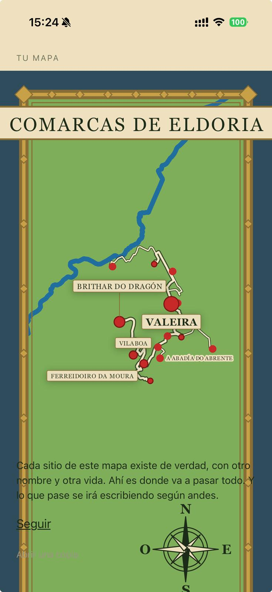

# Feedback del testing en iPhone — 14-ago-2026

El cuaderno de campaña del primer día de la app en un aparato iOS real: el iPhone 17 del dueño, compilación de desarrollo con Metro delante (`192.168.1.137:8081`) y el proxy en el 8138. Aquí se anota **lo que el dueño ve y dicta** durante el testing; cada entrada acabará convertida en fila del checklist, decisión de diseño o descarte, por el bucle de siempre — este fichero es la recogida, no el destino final.

Contexto del día: primera ejecución de la app en iOS de la historia del proyecto (hasta hoy, ninguna pantalla se había visto en un iPhone — `docs/iphone.md` §12e). El arranque, la creación de personaje (1/5 a 4/5) y el bundle por Wi-Fi funcionaron a la primera; los pantallazos y el vídeo del estreno están en el chat de la sesión orquestadora.

## 1 · La capa de teselas de A1P4 — la usuaria tiene que ver las calles reales

**Dictado por el dueño al verlo en su aparato**: la pantalla «Dónde generar el mapa del juego» (A1P4, paso 4/5 del arranque) enseña una superficie lisa gris donde debería verse el mapa real sobre el que se arrastra la marca. **«La usuaria tiene que poder ver el mapa con las calles reales aquí» — hay que corregirlo.**

Lo que hay detrás, medido: no es un fallo de iOS — `app/pantallas/mapa-real.jsx` declara en su cabecera que dibujar teselas necesita un módulo nativo que **ninguna spec ha nombrado todavía**, y antes que fingir un mapa, la superficie dice en voz alta que las calles no están (doctrina §6h: la pieza que al no estar no protesta). En el emulador de Android se ve exactamente igual. La marca y el círculo pintan encima porque son de `arranque.jsx`, sin librería.

Lo que queda para la fila que salga de aquí: la decisión de *que* haya calles está tomada por el dueño; falta **con qué dependencia** (`react-native-maps`, teselas sobre Skia, o lo que la spec proponga con su porqué), y esa dependencia se ratifica en el prompt antes de lanzar, como `expo-location` en la 48 y Health Connect en la 46. Nota de diseño que la spec no puede perder: A1P4 es **la única pantalla del juego donde se ven las calles tal cual** — la elección no sienta precedente para el resto del juego, que pinta el mapa de fantasía.

## 2 · «Tu mapa» (5/5): afinar el diseño de la pantalla

**Dictado por el dueño**, sin entrar en detalle a propósito — ya se verá qué se hace cuando llegue el momento: hay que afinar el diseño de esta pantalla. La captura del estreno (la primera generación del mundo en el iPhone, «Comarcas de Eldoria»): 
