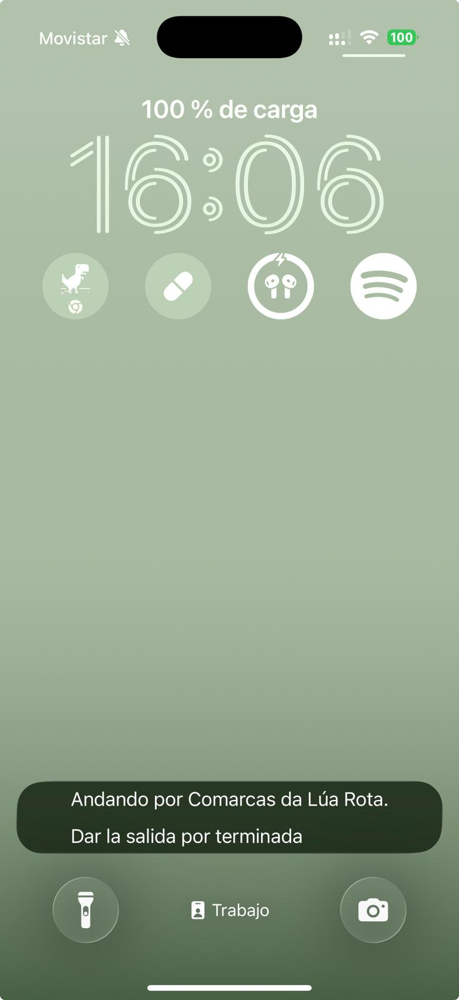

# Feedback del testing en iPhone — 14-ago-2026

El cuaderno de campaña del primer día de la app en un aparato iOS real: el iPhone 17 del dueño, compilación de desarrollo con Metro delante (`192.168.1.137:8081`) y el proxy en el 8138. Aquí se anota **lo que el dueño ve y dicta** durante el testing; cada entrada acabará convertida en fila del checklist, decisión de diseño o descarte, por el bucle de siempre — este fichero es la recogida, no el destino final.

Contexto del día: primera ejecución de la app en iOS de la historia del proyecto (hasta hoy, ninguna pantalla se había visto en un iPhone — `docs/iphone.md` §12e). El arranque, la creación de personaje (1/5 a 4/5) y el bundle por Wi-Fi funcionaron a la primera; los pantallazos y el vídeo del estreno están en el chat de la sesión orquestadora.

## 1 · La capa de teselas de A1P4 — la usuaria tiene que ver las calles reales

**Dictado por el dueño al verlo en su aparato**: la pantalla «Dónde generar el mapa del juego» (A1P4, paso 4/5 del arranque) enseña una superficie lisa gris donde debería verse el mapa real sobre el que se arrastra la marca. **«La usuaria tiene que poder ver el mapa con las calles reales aquí» — hay que corregirlo.**

Lo que hay detrás, medido: no es un fallo de iOS — `app/pantallas/mapa-real.jsx` declara en su cabecera que dibujar teselas necesita un módulo nativo que **ninguna spec ha nombrado todavía**, y antes que fingir un mapa, la superficie dice en voz alta que las calles no están (doctrina §6h: la pieza que al no estar no protesta). En el emulador de Android se ve exactamente igual. La marca y el círculo pintan encima porque son de `arranque.jsx`, sin librería.

Lo que queda para la fila que salga de aquí: la decisión de *que* haya calles está tomada por el dueño; falta **con qué dependencia** (`react-native-maps`, teselas sobre Skia, o lo que la spec proponga con su porqué), y esa dependencia se ratifica en el prompt antes de lanzar, como `expo-location` en la 48 y Health Connect en la 46. Nota de diseño que la spec no puede perder: A1P4 es **la única pantalla del juego donde se ven las calles tal cual** — la elección no sienta precedente para el resto del juego, que pinta el mapa de fantasía.

## 2 · «Tu mapa» (5/5): afinar el diseño de la pantalla

**Dictado por el dueño**, sin entrar en detalle a propósito — ya se verá qué se hace cuando llegue el momento: hay que afinar el diseño de esta pantalla. La captura del estreno (la primera generación del mundo en el iPhone, «Comarcas de Eldoria»): 

## 3 · Las dos capacidades que faltan en iOS — «solucionarlo antes de que yo salga a pasear»

**Dictado por el dueño al leer la pantalla de capacidades en su aparato**: sin HealthKit no se cuentan los pasos del día a día, y sin la Actividad en Vivo no hay rótulo en la pantalla de bloqueo — y la consecuencia declarada de lo segundo es que **en iOS una salida no se abre**. Las dos hay que resolverlas **antes del primer paseo real**.

Las dos estaban inventariadas en `docs/iphone.md` como decisiones que el día del salto exigiría, y hoy ese día llegó: son las próximas filas del checklist, cada una con su dependencia nativa ratificada en el prompt antes de lanzar (el patrón de `expo-location` en la 48 y Health Connect en la 46). Lo que cada módulo debe dar ya está escrito en el repo: `app/plataforma/rotulo.ios.js` pide un **widget de ActivityKit compilado dentro de la app** (y con él, que el tope de vida real de la Actividad se mida — riesgo 4 del PRD); `app/plataforma/salud.ios.js` es el doble declarado que la fila 46 dejó, con las restricciones del lector que no cambian de plataforma (metros o pasos en ventana, nada con recorrido) y la vuelta de `NSHealthShareUsageDescription` pasando por las reglas de lenguaje.

Y un tercer bloqueante del paseo, medido por la orquestadora el mismo día y que no es capacidad sino cordón umbilical: **la compilación de desarrollo vive atada a Metro por la Wi-Fi de casa** — en la calle, la app no tiene de dónde cargar su código. Hará falta hornear el bundle dentro del aparato para el testing andando, con cuidado con la tensión que crea: el cuaderno de a bordo vive tras `__DEV__` y el paseo instrumentado necesita las dos cosas a la vez.

## 4 · La puerta de desarrollo: ni entrada a mano ni vuelta a la portada

**Dictado por el dueño tras usarla en su iPhone**, dos cosas y sin entrar en detalle:

1. **No hay acceso directo a `walkingadventure://desarrollo`** — un botón, un enlace, algo que no obligue a teclear la URL o a que la abra otro desde el portátil (hoy la abrió la orquestadora por `devicectl`; a pie de calle eso no existe).
2. **Dentro del panel de desarrollo no hay opción de volver a la portada.**

Contexto mínimo para la fila que lo recoja: la puerta es herramienta tras `__DEV__` y fuera de `docs/flujo.md` a propósito (doctrina §6y) — cómo darle entrada y salida sin convertirla en pantalla del juego es parte de lo que habrá que decidir.

## 5 · La notificación de la pantalla de bloqueo: darle una vuelta

**Dictado por el dueño al verla en su iPhone**, sin entrar en detalle a propósito — ya se verá qué se hace cuando llegue el momento: hay que darle una vuelta a la notificación en pantalla de bloqueo. La captura («Andando por Comarcas da Lúa Rota · Dar la salida por terminada», primera vez del rótulo en una pantalla de bloqueo iOS, con la fila 55 en curso): 

## 6 · La pantalla de avería sin copia es un callejón sin salida

**Vivido por el dueño en su iPhone a las 23:00**: al abrir la app, «Tu partida guardada no se ha podido abrir» — y sin copia que abrir, **de esa pantalla no se puede salir**. En iOS ni siquiera existe el botón atrás del sistema que en Android al menos se lleva la app. La única acción visible, «Abrir una copia», no aplica cuando no hay copia. Captura: 

Contexto medido por la orquestadora, para separar las dos cosas que este incidente junta: **la partida averiada no era la del dueño** — es la de pruebas de la fila 55 (mapa `42.40,-8.81`, la coordenada de reserva del repo), y la avería encaja con haberse congelado y validado con dos estados distintos del bundle durante el desarrollo en el aparato (el motivo exacto de la guarda: la celda 0,0 nombra un núcleo «Fontenova a Branca» fuera de su porción del repertorio). Ese origen es ruido de taller. **Lo que no es ruido**: el callejón sin salida existe para cualquier usuaria real con una partida averiada y sin copia — la pantalla necesita una salida digna (empezar de nuevo, volver a la portada, lo que el diseño decida). Emparenta con el pendiente del botón atrás (`docs/pendientes.md`): qué hace la app donde el flujo no declara vuelta.
