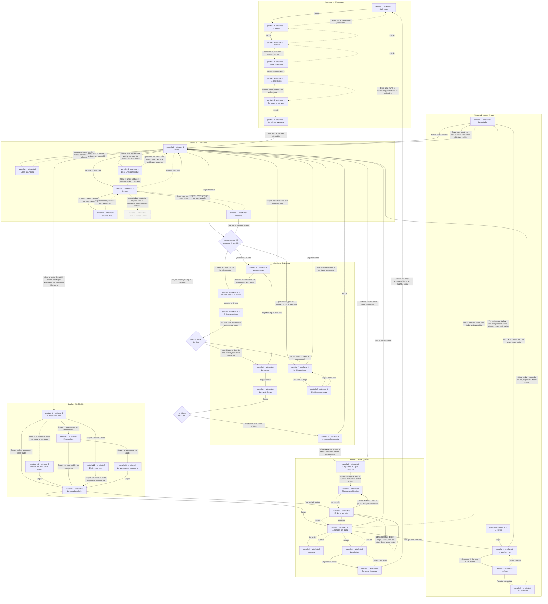

# El flujo del juego

Todas las pantallas de los seis artefactos de `docs/pantallas.md` y qué lleva de cada una a la siguiente. Los nodos son pantallas, etiquetadas **pantalla N · artefacto M**; las aristas llevan la acción que las recorre («pulsar Seguir») o la condición que las hace existir («solo si el desenlace era notable»).

Es la vista que ningún artefacto por separado puede dar: cada uno dibuja un momento, y las costuras entre momentos solo se ven aquí. De hecho las dos veces que un artefacto estaba mal —el visor sin salida hacia la escena, el cierre en corto leído como alternativa al mapa— el fallo era una arista que no existía.

**Se verifica solo.** `node scripts/verifica-flujo.mjs` extrae las pantallas de los seis HTML de `docs/pantallas/` y comprueba que el diagrama las contiene todas, sin sobrantes ni sueltas. Si se añade una pantalla a un artefacto, el script falla hasta que aparezca aquí.

**Lectura de las aristas.** Línea continua es un paso que ocurre; línea punteada es una relación que no es un paso: volver atrás, una equivalencia entre pantallas, o algo que se desbloquea. Los rombos son los tres puntos donde el camino se bifurca por el estado del mundo y no por lo que el jugador toque.

## Cómo leerlo

**El bolsillo es el centro de gravedad.** *Pantalla 1 · artefacto 3* es el nodo con más aristas de todo el diagrama, y es la pantalla que está diseñada para no mirarse. Todo lo que ocurre en la calle sale de ahí y vuelve ahí; el resto de los momentos son paréntesis entre dos ratos de andar.

**Solo hay tres rombos**, y ninguno es una pregunta al jugador: el sitio al que llegas, lo que hay debajo del visor y si el sitio es un núcleo. Las bifurcaciones de este juego las decide el mundo y el jugador decide con las piernas, que es lo que `bucle-jugable.md` §3 quería.

**El artefacto 3 casi no tiene aristas hacia dentro de sí mismo.** Sus pantallas cuelgan de la 1 y vuelven a la 1, sin encadenarse entre ellas: es la forma que toma en un diagrama la regla de que en marcha no hay ni un control tocable.

**Y hay dos entradas al arranque.** *Pantalla 1 · artefacto 1* la alcanza quien instala la app y quien pulsa «empezar de nuevo» en los ajustes, que es lo único del juego que borra un mundo que no se puede rehacer.
